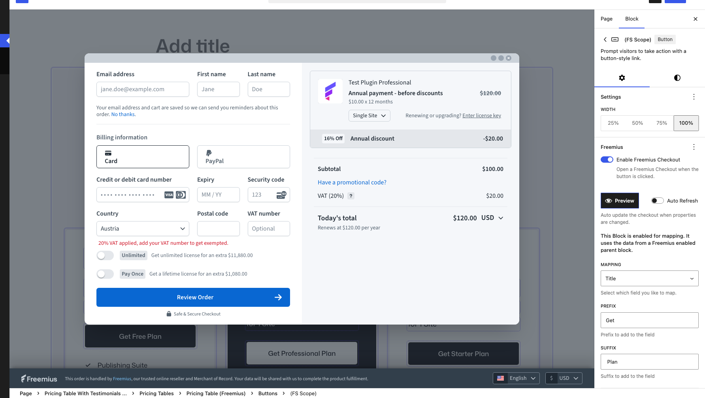

# Freemius for WordPress

If you are using WordPress with the Block Editor, the Freemius for WordPress plugin enables you to integrate the Freemius checkout directly and quickly while building landing/sales pages for your Freemius product. No JavaScript, theme hacking, or coding required!

**Not using the Block Editor?**

See how to use the [overlay checkout](https://freemius.com/help/documentation/selling-with-freemius/freemius-checkout-buy-button/) or the [hosted checkout](https://freemius.com/help/documentation/selling-with-freemius/freemius-checkout-hosted-page/).

Out of the box, Freemius for WordPress gives you:

- **Native Block Editor support (Gutenberg):** Drop checkout buttons or pricing tables directly into your page layouts - just like adding any other block.

  _For example: Add a "Buy Now" button to your landing page in seconds._

- **Dynamic pricing tables:** Display different plans with clear comparisons and calls-to-action.

  _Example: Showcase "Starter / Pro / Agency" tiers side by side, with checkout built in._

- **Plan switching and trials:** Let customers upgrade, downgrade, or start with a free trial seamlessly.

  _Example: Offer a 14-day free trial that auto-converts to a paid plan without extra coding._

- **Full compatibility with modern WordPress block themes and plugins:** Works out of the box with your existing WordPress block site setup - no theme hacks required.

- **100% free and open source:** Transparent, community-driven, and extensible.

  _Example: Extend the plugin with your own block variations, or contribute improvements back to the repo._

## Resources

- [Download from WordPress.org.](https://wordpress.org/plugins/freemius/)
- [GitHub repo.](https://github.com/Freemius/freemius-wp-plugin)
- [Test now on Playground.](https://playground.wordpress.net/?plugin=freemius)
- [Features, roadmap and the changelog.](https://github.com/Freemius/freemius-wp-plugin#readme)

## How do I set up a Freemius checkout button?

1. Download, install, and activate the plugin on your WordPress site.
2. Add a button block to your page or post, then enable the Freemius checkout option in the button settings.
3. Configure your product details, and the button will automatically handle the checkout process.

Here is a quick video demonstrating how to set up a Freemius checkout button:

[How to set up a Freemius checkout button](https://www.youtube.com/watch?v=MTOuIBGan7E)

For step-by-step guides in this documentation, see [Getting started](getting-started.md).

## Documentation

| Guide | What it covers |
| ----- | -------------- |
| [Getting started](getting-started.md) | Install the plugin, connect your Freemius product, add a checkout button, and build a pricing page |
| [Freemius Button](button.md) | Enable checkout on a button, scopes, preview, and optional settings |
| [Creating your Pricing page](creating-your-pricing-page.md) | Build a multi-plan pricing page with modifiers, scoped columns, mapped fields, and checkout buttons |
| [Scopes](scopes.md) | Nested pricing contexts on one page (groups, columns, buttons) |
| [Field mapping](mapping.md) | Pull plan price, title, description, and billing labels into blocks |
| [Scope modifiers](modifiers.md) | Currency, billing cycle, and license toggles on the page |
| [Settings](settings.md) | Admin tabs: Products, Editor Settings, and site-wide defaults |

## FAQs

### Can I customize the checkout experience?

Yes, you can customize various aspects of the checkout process through the plugin settings, including product details, pricing, and the checkout flow.

### How do I set up a Freemius checkout button?

Add a **Button** block, turn on **Freemius Checkout** in the Freemius panel, and set your product under **Settings → Freemius**. See [Getting started](getting-started.md) and [Freemius Button](button.md).

### Is the plugin compatible with my theme?

The plugin targets the Block Editor (Gutenberg). It works with block themes and classic themes that support the block editor.

### Where is pricing data loaded from?

Mapped prices and plan copy are saved when you edit and publish a page; the frontend does not call the Freemius API on every visit. After you change prices on the Freemius dashboard, reopen the page in the editor and **Update** it. See [Creating your Pricing page](creating-your-pricing-page.md#important-pricing-data-is-not-live-on-the-frontend).
