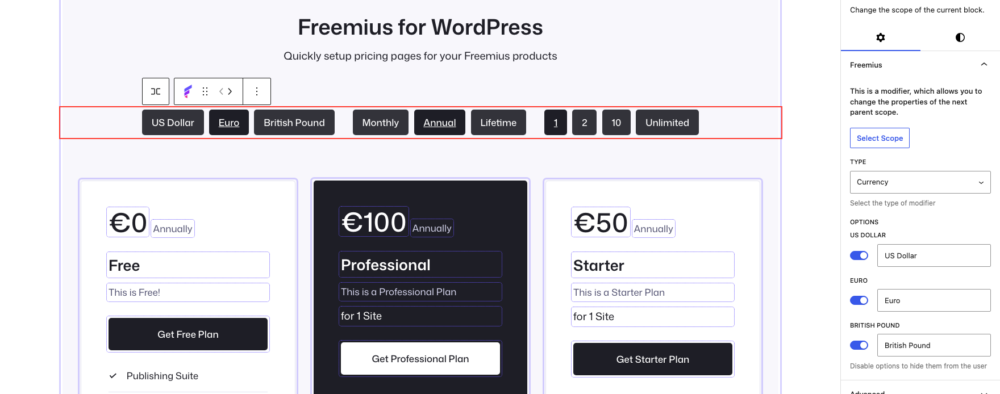

# Scope modifiers

**Modifiers** change settings for the parent scope they sit inside. They always affect the next enclosing scope up the block tree.

Add a modifier with the **Freemius Scope** block:

Click the modifier in the editor to adjust plan, pricing, or billing options for that section of the page.

See also: [Scopes overview](scopes.md).
