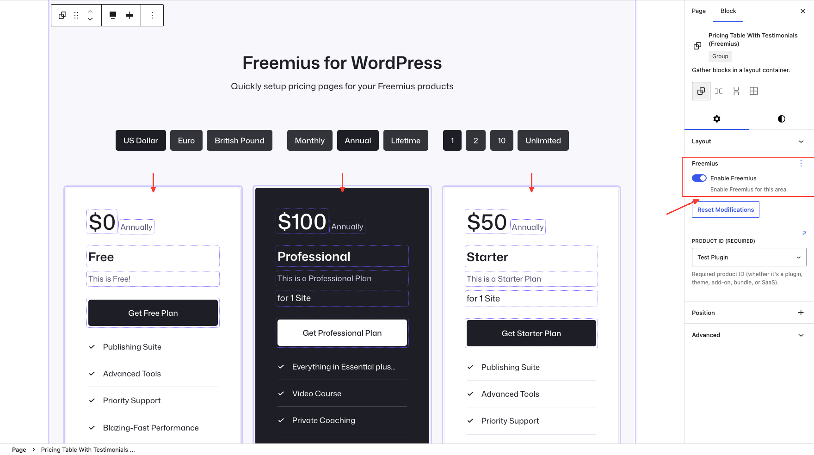

# Scopes

The plugin lets you create multiple **scopes** for your product on a single page. Each scope can have different pricing and checkout buttons.

A scope can be enabled on these blocks (or their children):

- Group Block
- Columns Block
- Column Block
- Button Block

In the editor, each plan column is its own scope (arrows above). A typical pricing page has one scope per plan column, plus an outer scope for the whole pricing area.

**Scopes** show a **purple outline** — the Freemius-enabled block that owns checkout settings for that area (product, plan, currency, and so on). Child blocks inherit from their parent scope unless you override them.

**Mapping fields** show a **dotted outline** — individual Paragraph, Heading, or Button blocks inside a scope that display plan data (price, title, description, and similar). Mapping binds block content to a Freemius field; it does not create a new scope.

Each scope inherits properties from its parent scope. The outermost scope inherits defaults from **Editor Settings**.

## Related topics

- [Field mapping](mapping.md) — bind plan fields to block content
- [Scope modifiers](modifiers.md) — change settings for the parent scope
- [Freemius Button](button.md) — button-level checkout and scopes
