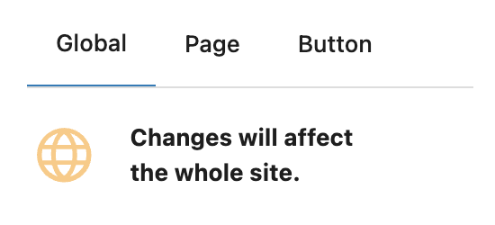

# Freemius Button

The Freemius Button extends the core Button block with Freemius Checkout. When enabled, clicking the button opens the Freemius Checkout popup.

## Overview

The example above uses a scoped group with a plan modifier and a core Button block with Freemius Checkout enabled. See [Scopes](scopes/README.md) and [Mapping](scopes/mapping.md) for building similar layouts.

## Getting started

1. Install [Freemius for WordPress](https://wordpress.org/plugins/freemius/).
2. Add a Button block to your content.
3. Enable **Freemius Checkout** in the block sidebar.
4. Configure settings as needed.

## Configuration scopes

Button settings can be configured at three scopes:

1. **Global** — site-wide defaults (Editor Settings)
2. **Page** — current post or page
3. **Button** — this button only

More specific scopes override broader ones.

## Key settings

- **Product ID** — Freemius product ID (required)
- **Public Key** — Freemius public key (required)
- **Plan ID**, **Pricing ID**, **Billing Cycle**, **Currency**, **Quantity**, **Coupon**
- **Success URL**, **Cancel URL**, **Custom Fields**

See [Freemius checkout documentation](https://freemius.com/help/documentation/selling-with-freemius/freemius-checkout-buy-button/) for details.

Hidden settings are listed in the Freemius **options menu** (three dots on the Freemius panel header). Open it to show or hide fields such as Product ID and Plan:

## Customization

Use standard WordPress button block controls for colors, typography, dimensions, border, and spacing.

## Events and callbacks

Handle checkout events with custom JavaScript:

- `purchaseCompleted`, `success`, `cancel`, `track`

Open **Popout Editor** for a larger code editor:

Examples: [Freemius tracking docs](https://freemius.com/help/documentation/selling-with-freemius/freemius-checkout-buy-button/#tracking_purchases_with_google_analytics_and_facebook).

## Preview

Use **Preview** in the sidebar or toolbar to test checkout. **Auto Refresh** updates the preview when settings change.

## Tips

- Set common options at global scope; override on page or button when needed
- Test with Preview before publishing
- Use callbacks to integrate analytics or custom flows
