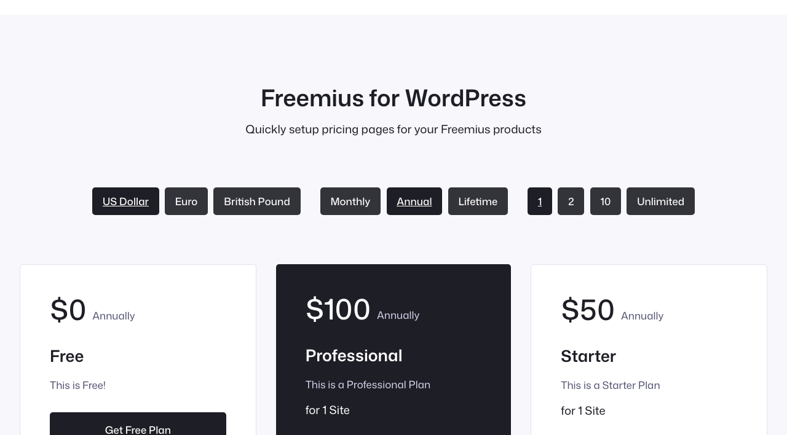
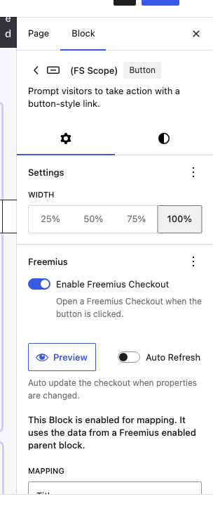
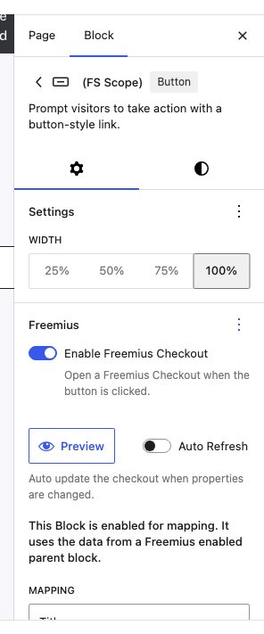
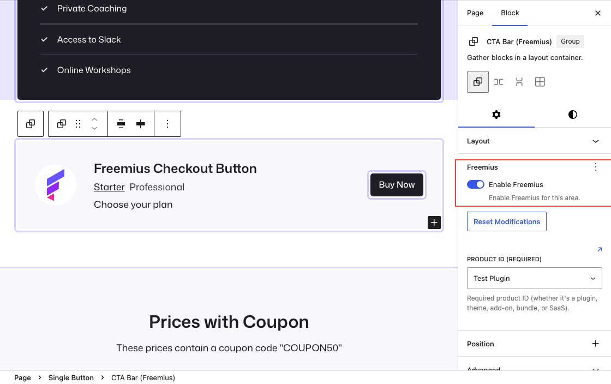
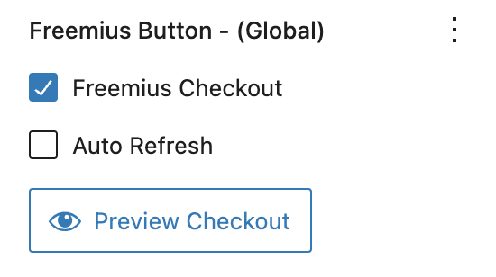

# Creating your Pricing page

Build a multi-plan pricing page that displays prices and plan details from your Freemius product, lets visitors switch currency and billing cycle, and opens checkout from each plan.

## Important: pricing data is not live on the frontend

Mapped prices, titles, and descriptions are **saved into your page content** when you edit and publish. The plugin does **not** call the Freemius API on every page view — that would slow down your site.

**When you change anything on the Freemius site** (prices, plan names, descriptions, currencies, and so on):

1. Open your pricing page in the **block editor**.
2. Wait for the editor to load the latest product data into your mapped blocks. If values still look old, **clear your site cache** (and any page-cache plugin) and reload the editor.
3. Check that mapped fields show the correct prices and copy.
4. **Update** the page so the new values are saved and visitors see them.

Until you update the page, visitors will keep seeing the prices and text from the last publish.

## What you'll build

A typical pricing page has:

- One **outer scope** (Group or Section) tied to your product
- **Modifiers** for currency, billing cycle, and license count
- One **column per plan**, each with its own scope and plan ID
- **Mapped fields** for price, title, description, and billing labels
- A **checkout button** in each column

The editor view below shows the same layout with scope outlines (purple) and mapped fields (dotted):

## Before you start

1. Install and activate Freemius for WordPress.
2. Connect your product under **Settings → Freemius → Products** (Product ID and Token from the [Freemius Developer Dashboard](https://dashboard.freemius.com/)).
3. Set site-wide defaults under **Editor Settings** — at minimum **Product ID** and a default **Plan**.

See [Getting started](getting-started.md) and [Settings](settings.md) if you have not done this yet.

## Step 1: Create a new page

1. In the WordPress admin, go to **Pages → Add New**.
2. Give the page a title such as **Pricing**.
3. You can start from a blank page or insert a block pattern that includes columns — you will wire up Freemius scopes in the steps below.

## Step 2: Add an outer scope

The outer scope sets the **product** and default **currency** and **billing cycle** for everything inside it.

1. Add a **Group** block (or **Columns** / **Section** wrapper) that will contain the whole pricing area.
2. Select that block.
3. In the block sidebar, open **Freemius** and enable **Freemius Checkout**.
4. Confirm **Product ID** is set (it inherits from Editor Settings if you configured it there).

This block is now the parent scope. Every child block inside it inherits these settings unless you override them.

## Step 3: Add a page title and intro

Inside the outer scope, add a **Heading** and **Paragraph** for your page title and short description. These are regular blocks — no Freemius mapping required.

## Step 4: Add pricing toggles

Let visitors change currency, billing cycle, and license count without leaving the page.

1. Below the intro, add a horizontal **Group** (flex layout works well).
2. Insert a **Freemius Scope** block for each toggle you need:
   - **Currency** — e.g. USD, EUR, GBP
   - **Billing cycle** — Monthly, Annual, Lifetime
   - **Licenses** — e.g. 1, 2, 10, Unlimited

Modifiers update the parent scope. On the published page, toggles switch between values that were available when you last saved the page — they do not fetch new data from Freemius on each visit. See [Scope modifiers](scopes/modifiers.md) for details.

## Step 5: Add a column for each plan

1. Add a **Columns** block inside the outer scope.
2. Use one **Column** per Freemius plan (Free, Starter, Professional, etc.).
3. Style each column with borders, background, and spacing to match your theme.

## Step 6: Set the plan on each column

Each column needs its own scope so it shows a different plan.

1. Select a **Column** block.
2. In the sidebar, open **Freemius** and enable **Freemius Checkout**.
3. Set **Plan ID** to the plan this column represents.

Repeat for every column. Child blocks inside a column inherit that column's plan.

## Step 7: Map plan fields to content

Inside each column, add blocks and map Freemius fields so prices and copy are filled from your product **while you edit**. The editor fetches product data from Freemius and writes the current values into each mapped block; those values are stored in the page when you publish.

**Recommended blocks and fields:**

| Block | Typical mapping |
| ----- | ---------------- |
| Paragraph (large) | **Price** |
| Paragraph (small) | **Billing cycle** (with custom labels such as "Monthly" / "Annually") |
| Paragraph | **Title** |
| Paragraph | **Description** |
| Paragraph | **Licenses** (optional, e.g. "for 1 Site") |

1. Add the block (Paragraph, Heading, or Button).
2. Select it and open **Freemius** in the sidebar.
3. Under **Field mapping**, choose the field (Price, Title, Description, etc.).
4. Optionally set a **prefix** or **suffix** on the mapping (for example `Get ` and ` Plan` on a button label).

Mapped blocks show a dotted outline in the editor. See [Field mapping](scopes/mapping.md).

## Step 8: Add a checkout button per plan

1. At the bottom of each column, add a **Button** block.
2. Enable **Freemius Checkout** on the button.
3. Optionally map the button label to **Title** with a prefix/suffix (e.g. `Get ` + plan name + ` Plan`).

The button inherits the column's plan and the outer scope's currency and billing cycle. See [Freemius Button](button.md).

## Step 9: Add feature lists

Plan features (bullet lists, checkmarks, separators) are ordinary blocks — add them manually in each column. They are not synced from Freemius; only pricing fields are mapped.

## Step 10: Preview and publish

1. Select any scoped block or checkout button.
2. In the Freemius sidebar, click **Preview** to open checkout with the current settings.
3. On the frontend, click the currency and billing modifiers and confirm prices and labels look correct for the data you just saved.
4. When everything looks right, **Publish** (or **Update**) the page.

After you change pricing on the Freemius site, repeat these steps: open the page in the editor, wait for fresh data (clear cache if needed), then **Update** the page again.

## Tips

- Set **Product ID** and other common options once in **Editor Settings**; override only where a page or column differs.
- Use **Preview** on each plan's button before publishing.
- If a mapped price shows `$0` or is empty, check that the plan has pricing for the selected currency, billing cycle, and license count.
- After Freemius dashboard changes, always **re-open the pricing page in the editor** and **Update** it — the frontend will not pick up new prices on its own.
- For a single-plan landing page, you can skip columns and modifiers — see [Freemius Button](button.md).

## Related guides

- [Scopes](scopes/README.md) — how nested scopes inherit settings
- [Field mapping](scopes/mapping.md) — supported fields and blocks
- [Scope modifiers](scopes/modifiers.md) — currency, billing, and license toggles
- [Freemius Button](button.md) — checkout buttons and preview
