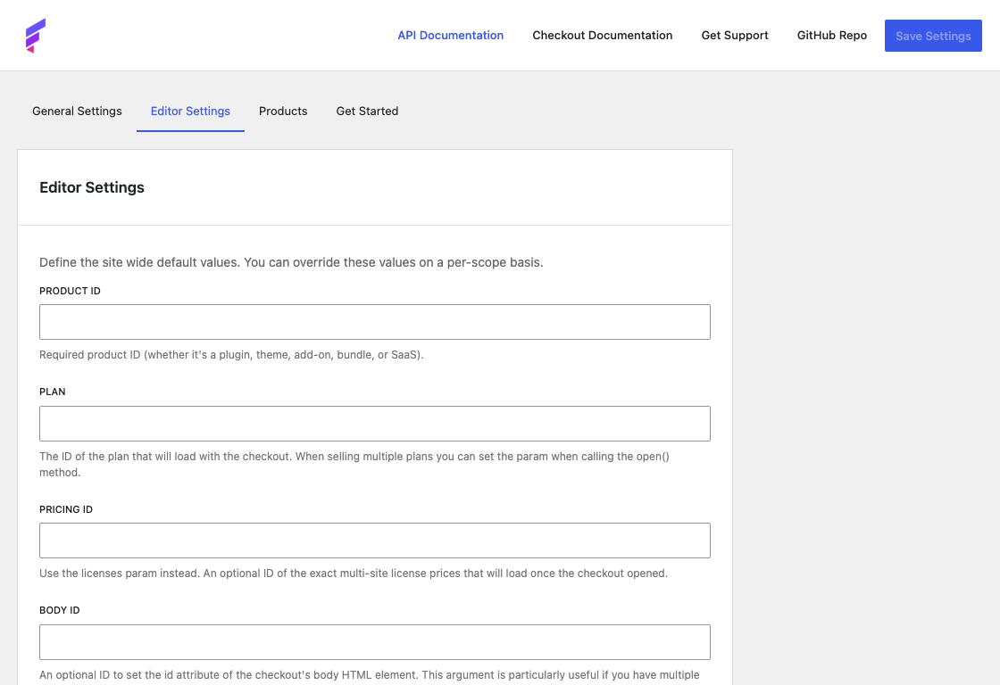
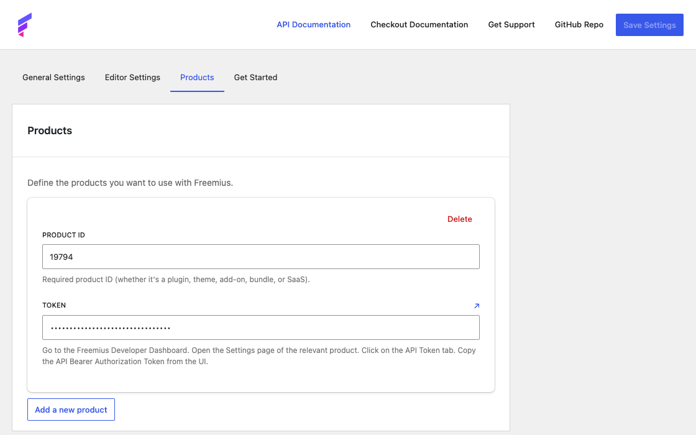

# Settings

Global plugin settings live at **Settings → Freemius** in the WordPress admin. The page is organized into tabs:

## General Settings

Plugin-wide options that apply to Freemius as a whole — for example, environment and other global configuration.

## Editor Settings

Define site-wide defaults for checkout fields (such as Product ID and Plan). Every scope in the block editor inherits these values unless you override them on a page or block.

Page- and block-level settings override these defaults. See [Configuration scopes](button.md#configuration-scopes) on the button guide.

## Products

Add the Freemius products you want to use across the site. For each product, enter a **Product ID** and **Token**. You can find both in the [Freemius Developer Dashboard](https://dashboard.freemius.com/) — open your product’s **Settings**, then the **API Token** tab, and copy the values from there.

Use the **Products** tab when you sell more than one product and need separate credentials for each.

## Get Started

A short video walkthrough for setting up Freemius on your site.
